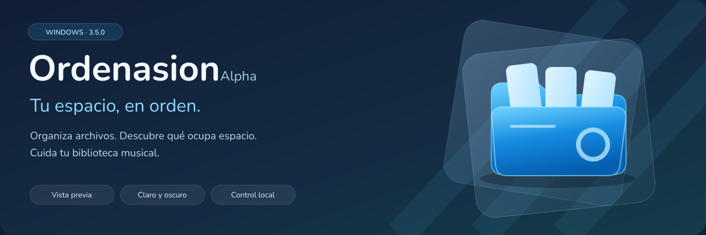
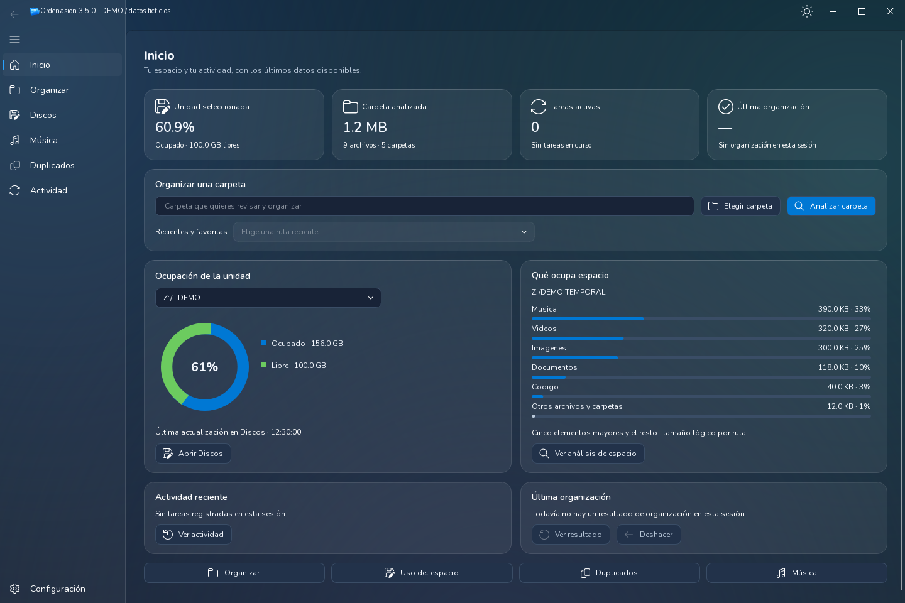
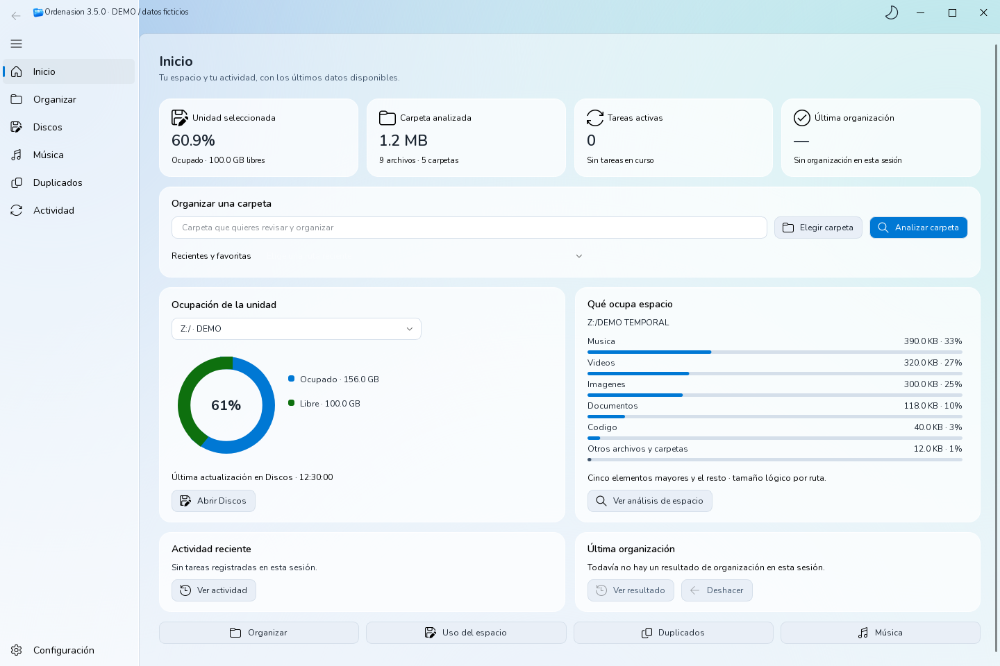
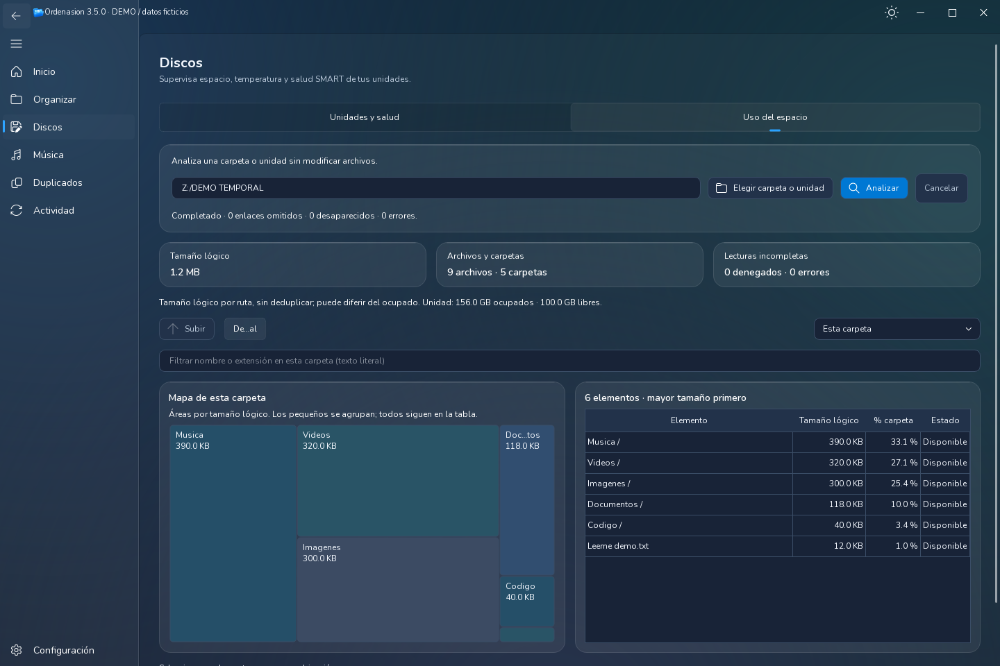
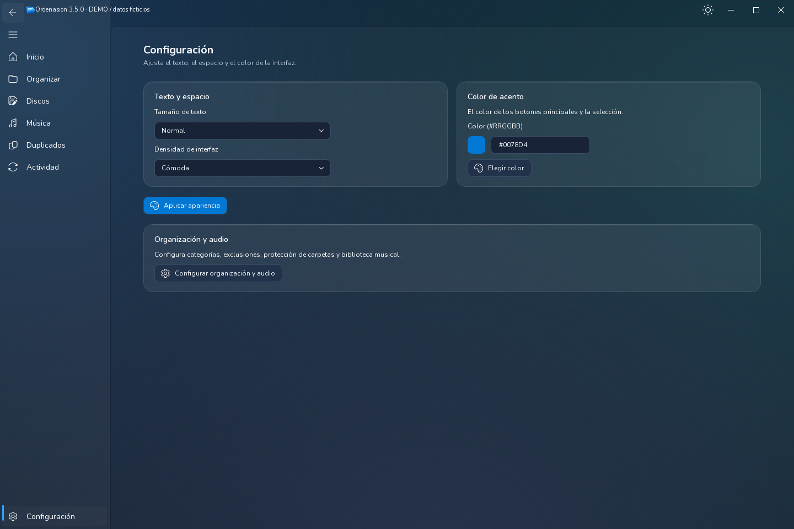

<div align="center">



# Ordenasion Alpha

**Organiza tus archivos con control. Entiende tu espacio. Cuida tu música.**


[](LICENSE)

[**⬇ Descargar EXE 3.5.0**](https://github.com/Kristianesp/Ordenasion_alpha/releases/download/v3.5.0/Ordenasion_v3.5.0.exe) · [Última versión](https://github.com/Kristianesp/Ordenasion_alpha/releases/latest) · [Código de la interfaz 3.5](https://github.com/Kristianesp/Ordenasion_alpha/tree/Mejoras-UI)

</div>

Aplicación de escritorio para Windows, desarrollada con Python y PyQt6. Reúne organización de archivos, análisis del espacio, duplicados y biblioteca musical en una interfaz **Fluent Ocean Frost**, con temas claro y oscuro.

## 📸 Un vistazo

**Inicio · tema oscuro**



<table>
  <tr>
    <td width="50%"><strong>☀️ Inicio · tema claro</strong><br><a href="docs/images/inicio-claro.png"></a></td>
    <td width="50%"><strong>🗺️ Uso del espacio</strong><br><a href="docs/images/uso-del-espacio.png"></a></td>
  </tr>
</table>

<details>
<summary><strong>🎨 Ver configuración de apariencia</strong></summary>



</details>

*Capturas de la interfaz real 3.5.0, renderizadas con Qt. Archivos temporales y ocupación ficticia, señalados como DEMO; no representan datos del usuario. Pulsa las miniaturas para ampliarlas.*

## ✨ Qué puedes hacer

| Herramienta | Para qué sirve |
| :--- | :--- |
| 📂 **Organizar** | Clasifica por categorías y, opcionalmente, por fecha. Revisa la selección y los destinos antes de confirmar. |
| 🗺️ **Uso del espacio** | Explora tamaños con mapa y tabla, navega por carpetas, filtra y consulta los elementos mayores. |
| 💽 **Discos** | Consulta ocupación y salud SMART cuando el dispositivo y las herramientas permiten obtenerla. |
| 🎵 **Música** | Indexa tu biblioteca, reproduce audio, compara copias y edita metadatos. |
| 🔎 **Duplicados** | Busca candidatos mediante análisis rápido, híbrido o profundo y revisa qué copia conservar. |
| ⚙️ **Configuración y actividad** | Ajusta apariencia, categorías y exclusiones; sigue tareas, resultados y el registro de la sesión. |

**Tú decides qué se mueve.** La organización incluye vista previa y resolución de conflictos: conservar ambos, sobrescribir u omitir. Deshacer está disponible cuando existe una transacción reversible. El análisis del espacio es manual y no modifica archivos.

## 🚀 Novedades de 3.5.0

1. **Inicio operativo:** métricas y gráficas basadas en los últimos datos disponibles, con estados vacíos explícitos.
2. **Fluent Ocean Frost:** superficies de vidrio, tema global claro/oscuro, navegación lateral y ajustes compactos.
3. **Organización guiada:** análisis → revisión → resultado; selección conservada y conflictos antes de ejecutar.
4. **Espacio y biblioteca:** nuevo mapa de carpetas, cancelación cooperativa y herramientas musicales bajo demanda.
5. **Arranque propio:** icono, splash tematizado, fuentes incluidas y ejecutable Windows con recursos y licencias.

Consulta el [changelog completo de 3.5.0](https://github.com/Kristianesp/Ordenasion_alpha/blob/Mejoras-UI/CHANGELOG.md#350--2026-09-27) y las [notas de la release](https://github.com/Kristianesp/Ordenasion_alpha/releases/tag/v3.5.0).

## ▶️ Empezar

### Con el ejecutable

Descarga [Ordenasion_v3.5.0.exe](https://github.com/Kristianesp/Ordenasion_alpha/releases/download/v3.5.0/Ordenasion_v3.5.0.exe) y ábrelo en Windows; no necesitas instalar Python. Elige una carpeta, analiza y revisa los movimientos antes de confirmar.

### Desde el código

La interfaz 3.5 está en **Mejoras-UI**. En Windows, con Git y Python 3.12 x64:

```powershell
git clone --branch Mejoras-UI https://github.com/Kristianesp/Ordenasion_alpha.git
cd Ordenasion_alpha
py -3.12 -m venv venv
.\venv\Scripts\python.exe -m pip install -r requirements.txt
.\arrancar_ordenasion.bat
```

El BAT utiliza el entorno virtual local. `arrancar_ordenasion.bat --comprobar` verifica el punto de entrada y las dependencias sin abrir la aplicación. También puedes iniciar directamente con `venv\Scripts\python.exe main_fluent.py`.

### Compilar y verificar

La [guía de compilación y release](https://github.com/Kristianesp/Ordenasion_alpha/blob/Mejoras-UI/releases_tags_creacion_exes.md) explica las dependencias de build, la spec de PyInstaller y el smoke aislado. El paquete esperado es `Ordenasion_v3.5.0.exe`.

Las [pruebas](https://github.com/Kristianesp/Ordenasion_alpha/tree/Mejoras-UI/tests) cubren organización, conflictos, espacio, temas, audio y empaquetado. Para ejecutarlas en el entorno de desarrollo:

```powershell
.\venv\Scripts\python.exe -m pip install pytest
.\venv\Scripts\python.exe -m pytest -q
```

## 📄 Licencia

Código distribuido bajo **GNU GPL v3**, según [LICENSE](LICENSE). Las fuentes Nunito incluyen su [licencia OFL](https://github.com/Kristianesp/Ordenasion_alpha/blob/Mejoras-UI/assets/fonts/OFL.txt); las dependencias y herramientas conservan sus respectivas licencias.
